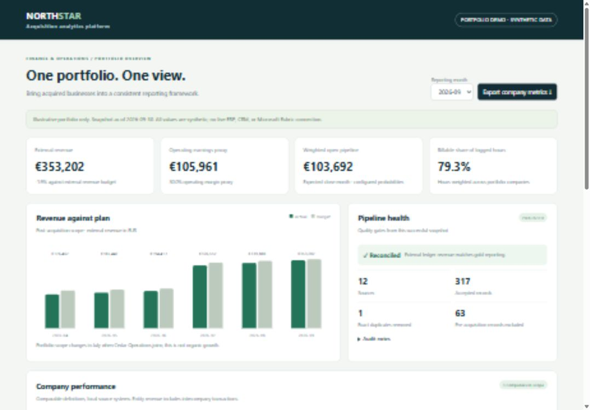
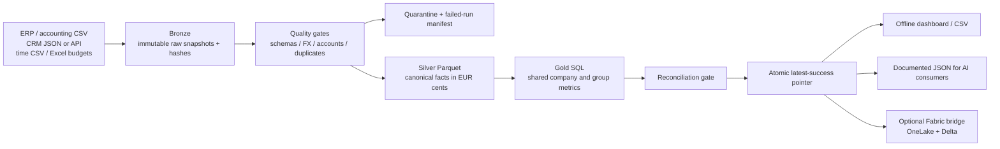

# Acquisition Analytics Platform

**An auditable finance and operations platform for integrating acquired businesses.**

Built by Lipsa Priyadarshinee. A portfolio project using **only synthetic data**.

This project turns incompatible ERP/accounting exports, CRM snapshots, time records and Excel budgets into one documented reporting model. It includes a working local pipeline, Parquet data products, a self-contained interactive dashboard, quality gates, acquisition onboarding and a Microsoft Fabric adaptation guide.



## What is implemented

| Hiring requirement | Working demonstration |
|---|---|
| Layered lakehouse architecture | Immutable bronze snapshots → validated silver Parquet → shared gold Parquet, queried with DuckDB |
| Source integration | CSV, JSON, Excel and a generic paginated HTTP API connector; column mappings per source |
| Finance and operational data products | Company/month and group/month outputs with documented keys, lineage and metric definitions |
| Consistent KPIs | One executable SQL model for revenue, operating earnings proxy, budget variance, weighted pipeline and billable share |
| Acquisition integration | Company-specific chart of accounts, effective acquisition dates, three currencies and an onboarding playbook |
| Operations and monitoring | Snapshot freshness, validation quarantine, reconciliation, run manifests, writer lock and last-good publication |
| Git-driven delivery | GitHub Actions tests and demo-build artifact; Dockerfile; no embedded credentials |
| Shared reporting / AI consumption | Offline dashboard, downloadable CSV, Parquet, JSON and a factual AI-context export |

**Boundary:** Local execution uses DuckDB and Parquet, not a live Microsoft Fabric tenant. `fabric/` contains a PySpark/Delta bridge notebook and deployment instructions. It has not been executed in Fabric. There are no production ERP vendor connectors, production users, or live AI agents. Financial outputs are illustrative, not audited consolidation.

## Quick start (Python 3.11 or 3.12)

```bash
python -m venv .venv
# Windows PowerShell: .venv\Scripts\Activate.ps1
# macOS/Linux: source .venv/bin/activate
pip install -r requirements.txt
python -m portfolio_analytics demo
```

The command prints the full path to `dashboard.html`. Open that file in your browser; it needs no server or internet connection. A ready-built example is included at `preview/dashboard.html`, with ordinary CSV exports beside it.

The demo generates **three fictional businesses, 12 sources and six reporting months**. Cedar joins in July. The API connector has a real localhost pagination test; the default demo uses exported snapshots so it runs offline.

`demo` refuses to overwrite an existing configuration. To rerun existing sources:

```bash
python -m portfolio_analytics run
python -m portfolio_analytics status
python -m unittest discover -s tests -v
```

To create a separate copy: `python -m portfolio_analytics demo --project another-demo`.

## Architecture



The model is a **full-snapshot rebuild**, intentionally small and understandable. Reruns do not append duplicate facts. Removed source rows disappear on the next successful rebuild. Each run has its own warehouse and versioned Parquet exports. Failed runs never move `latest.json`.

## Explore the demo

1. Open the dashboard and select June, then July: Cedar enters the consolidation scope.
2. Compare entity revenue to external revenue in September: a matching €800 intercompany pair is excluded at group level.
3. Read the quality panel: one intentional exact duplicate is removed and logged.
4. Export company metrics. Monetary fields ending in `_cents` are integers, not euros.
5. Read a run's `manifest.json`, `config_snapshot.json`, `gold.sql` and `quarantine.json` for audit evidence.
6. Change one account in `data/alp_ledger.csv` to `UNKNOWN`, run again, and see publication fail. Restore it and rerun. The previous successful report remains available throughout.

## Generic API demonstration

Run `python scripts/mock_crm_api.py` in a second terminal. In the generated `config/portfolio.json`, change `alp_crm` to:

```json
{
  "id": "alp_crm", "company": "ALP", "kind": "crm", "format": "api",
  "url": "http://127.0.0.1:8766/deals", "snapshot_as_of": "2026-09-30",
  "max_age_days": 7, "min_rows": 1
}
```

Then run the pipeline. Real endpoints must use HTTPS and follow the documented `{ "items": [...], "next": "absolute URL or null" }` contract. Optional `token_env` names an environment variable containing a bearer token. Tokens are never copied into configuration. Pagination cannot leave the original origin, and redirects are blocked. Retries cover transient network errors, throttling and selected server errors.

## Repository map

- `portfolio_analytics/`: connectors, synthetic generator, validation, orchestration, reporting and CLI.
- `sql/gold.sql`: centralized KPI implementation.
- `templates/dashboard.html`: self-contained report interface.
- `tests/`: reconciliation, quality, rerun, failure recovery, source deletion and HTTP integration tests.
- `docs/metrics.md`: grain, calculations, reporting scope and assumptions.
- `docs/data-contracts.md`: input/output contracts and lineage.
- `docs/onboarding.md`: integrating the next acquisition.
- `docs/runbook.md`: operation, alerts, failures, security and publication.
- `docs/interview-notes.md`: a truthful project explanation and demo script.
- `fabric/`: cloud adaptation notebook and release guide.
- `.github/workflows/ci.yml`: test and package on pull requests/pushes.

## Microsoft Fabric

See [Fabric deployment guide](fabric/README.md). The optional bridge imports a validated snapshot into versioned Delta tables and recomputes gold metrics with Spark. Actual workspace integration, identities, security, orchestration schedules and promotion require your Fabric environment and validation there.

Git tracks source and configuration definitions; it is not a backup of lakehouse business data. No live cloud deployment is claimed.

## Publish to your GitHub

Create a new repository named `acquisition-analytics-platform`, then push this folder as its repository root. Do not upload the outer ZIP as the only repository file.

```bash
git init
git add .
git commit -m "Build synthetic acquisition analytics platform"
git branch -M main
git remote add origin https://github.com/lipsapriyadarsinee101-oss/acquisition-analytics-platform.git
git push -u origin main
```

The generated `data/` and `lakehouse/` folders are ignored. The committed generator reproduces the fixtures. The included `preview/` is synthetic, safe to share, and does not require cloud credentials. Keep real client data, `.env`, tokens and workspace secrets out of Git.

## Validation

14 automated tests pass locally. See [validation record](docs/validation.md) for checks, sample totals and unverified infrastructure/browser-download steps.

## Development boundaries and next steps

- Full refresh rather than CDC; one local writer rather than distributed concurrency.
- Monthly average demo FX, two-decimal currencies, full acquisition-month budget; no closing-rate balance sheet translation or mid-month budget proration.
- Matching intercompany revenue/cost exclusion with monthly balance gate; no purchase price allocation, minority interests, tax, cash flow or full accounting consolidation.
- No RBAC/authentication on an offline HTML file. Share only the synthetic preview publicly.
- API freshness metadata is supplied by the source configuration; production must derive/check it against authoritative source watermarks.
- No automated external alerts yet: manifests, exit codes and CLI status are the monitoring interface.
- Fabric code is provided for adaptation and has not been cloud-validated; CI builds a local artifact, it does not deploy to Fabric.

Priorities for a real environment: source-owner sign-off, certified KPI definitions, managed identities and row-level access, vendor-specific incremental connectors, orchestration alerts, scheduled reconciliation and BI semantic-model governance.
