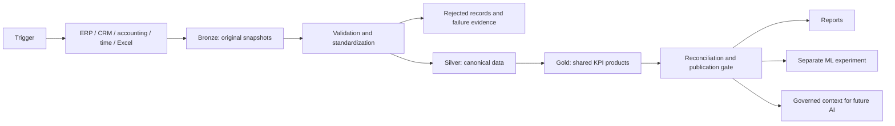

# My approach to acquisition analytics engineering

## My objective
I would build on the Finance team's existing Fabric lakehouse to make acquired companies' performance visible, reliable and comparable. I would start with agreed reporting priorities, deliver one reconciled source-to-report flow, then expand across the group.

This is my proposed delivery approach, supported by a synthetic portfolio project. It is not a claim of production Fabric ownership or live vendor integration.

## How my CV connects to the role

My strongest fit for this role is my background in **Python, SQL, ETL, API integration, Power BI and machine learning**. My first priority would be dependable data integration and consistent reporting for Finance and Operations. I would introduce ML and AI where they address clear business needs once that foundation is reliable.

The working project runs locally with **DuckDB and Parquet**. The employer's existing platform uses **Microsoft Fabric**. This repository documents an adaptation path to Fabric that still needs deployment and testing in a Fabric environment; it does not establish production Fabric experience.

| Background described in my CV | Application to this role |
|---|---|
| Python/SQL ETL, AWS/Azure, API ingestion and validation at Infosol Technosol | Build maintainable ingestion, transformations and operational monitoring |
| ML development, feature engineering and predictive reporting | Evaluate forecasting after establishing reliable reporting data |
| Power BI reporting and business requirements at Edelweiss Tokio Life | Agree consistent Finance and Operations metrics |
| Multi-source ETL and Finance/Operations dashboards at Yoshop | Connect company sources and trace reports to source records |
| Git, GitHub, Docker and CI/CD | Review, test and release changes consistently |

These are self-reported CV experiences, not measured outcomes of this repository. My CV demonstrates Azure familiarity, but does not establish production Microsoft Fabric ownership. I would explain that distinction openly. This repository does not include my CV file or personal contact details.

## 1. Begin with the business questions
I would agree the first reporting decisions and deadlines with Finance, Controlling and Operations. I would identify the entities, acquisition dates, currencies, authoritative sources, source owners and approval process.

The first deliverable would be a company-month report containing agreed revenue, mapped costs, budget variance and operational measures, reconciled to approved source control totals.

## 2. Connect ERP, CRM, accounting, time tracking and Excel
| Source | Initial approach | Important checks |
|---|---|---|
| ERP/accounting | Approved exports or read-only API/database extraction | Business keys, chart of accounts, currency, periods, source control totals |
| CRM | Dated exports or paginated API | Opportunity IDs, amounts, stages, freshness and deletion handling |
| Time tracking | Structured files or API | Hours, billable hours and company/project mappings |
| Excel budgets | Approved versioned template | Required columns, company-period uniqueness and budget approval |

The current project implements generic CSV, JSON, Excel and paginated API ingestion. A SAP, Dynamics, Salesforce or other vendor connector would require its own authentication, mapping and integration tests. A generic connector does not establish vendor compatibility.

I would begin with full snapshots where practical. For larger sources I would implement incremental loads using reliable watermarks, retries, replay, deletion handling and reconciliation. Credentials belong in the deployment's secret store.

## 3. Apply the lakehouse concept
A data lake stores raw and processed data. A lakehouse adds structured tables and query capabilities to support reporting and analytical use.



- **Bronze:** keep original snapshots and source lineage.
- **Silver:** validate records, remove exact duplicates, map accounts, normalize currencies and apply acquisition scope.
- **Gold:** publish company-month and group-month products with shared calculations.
- **Publication:** retain the last accepted report if a new run fails.

This is ETL-style data engineering: extract source records, transform them into consistent business data, and load reusable outputs. With raw landing before transformation, the lakehouse flow also follows an ELT pattern.

The working demo uses Python, SQL, DuckDB and Parquet. Fabric/OneLake and Delta are the target described in the [Fabric adaptation guide](../fabric/README.md). That bridge has not been executed in a tenant.

## 4. Configure triggers, orchestration and monitoring
These are proposed production choices. The current local pipeline runs manually; GitHub already triggers code checks.

| Trigger | Intended use | Guard |
|---|---|---|
| Schedule | Daily ingestion after sources are ready | Explicit timezone, freshness checks and agreed deadline |
| File arrival | Ingest a completed approved export | Deduplicate file events and reject partial files |
| Upstream success | Run Silver after Bronze, Gold after validation | Stop dependent steps when checks fail |
| Manual | Acquisition onboarding, backfills or recovery | Record parameters and run ID |
| GitHub pull request/push | Test changes and build synthetic artifacts | Keep real data and production secrets outside the demo |

I would monitor failed runs, freshness, row counts, rejected records, reconciliation differences and duration. Alerts should identify the affected source, owner and run. The current repository provides manifests and exit codes; external alert delivery remains to be configured.

Fabric supports scheduled and event-based pipeline runs. The actual event source and tenant setup need validation in the employer's environment: [Microsoft pipeline documentation](https://learn.microsoft.com/en-us/fabric/data-factory/pipeline-runs).

## 5. Define metrics once
Finance owns definitions and approvals; engineering implements them consistently and tests them.

| Metric | Repository calculation | Boundary |
|---|---|---|
| Group revenue | External revenue across in-scope companies | Simplified intercompany handling |
| Operating earnings proxy | Revenue minus mapped direct and operating costs | Not certified EBITDA |
| Revenue budget variance | (Actual external revenue - budget) / budget | Undefined for zero budget |
| Weighted open pipeline | Opportunity amount times configured stage probability | Rules-based, not ML |
| Billable share | Billable minutes / logged minutes | Not staff-capacity utilization |

Each data product needs a grain, owner, field definitions, currency, freshness expectation, quality rules and lineage. The [metric contract](metrics.md) and [data contracts](data-contracts.md) are the starting point. In production, Power BI would consume approved products through a governed semantic model.

## 6. Use Git and GitHub for delivery
My workflow would be: feature branch -> pull request -> automated checks -> review -> development validation -> test -> approved production promotion.

Version source code, SQL definitions, non-secret configuration templates and deployment assets. Keep real customer records, credentials and lakehouse data out of Git. A release should record its commit, environment configuration and rollback procedure, including schema compatibility.

The current GitHub workflow tests the code and builds a synthetic local artifact. It does not deploy to Fabric. Workspace integration and promotion must be configured and validated separately: [Microsoft Fabric CI/CD guidance](https://learn.microsoft.com/en-us/fabric/data-factory/cicd-pipelines).

## 7. Introduce machine learning after reliable reporting
The new [forecasting module](../portfolio_analytics/predictive.py) fits a linear revenue trend per company and compares it with a last-month baseline through chronological validation.

```bash
python -m portfolio_analytics.predictive --report preview/report.json --output work/predictive.json
python -m unittest discover -s tests -p "test_predictive.py" -v
```

It uses Python's standard library, requires at least six consecutive completed months, and skips incomplete histories or acquisitions with too few observations. Each validation forecast trains only on earlier months. Forecasts stay separate from actuals and include a source run ID and report hash.

The module does not forecast the group: acquisition-driven scope changes could distort a simple group trend. Six synthetic months demonstrate mechanics, not real predictive accuracy. Model selection uses the validation scores, so those scores are not an independent final test. No seasonality or uncertainty interval is modeled.

Before production use I would obtain longer histories, verify month completeness, retain a separate time-based test set, evaluate each company, monitor drift and obtain Finance review. Cash collection forecasting and unusual-posting detection are possible later use cases, but need data absent from this demo.

## 8. Apply AI to governed data
The existing AI-context export and the new predictive JSON provide traceable inputs for a future assistant. No LLM or autonomous agent is connected.

A future assistant could retrieve approved definitions and query permitted Gold data to answer questions such as “Which companies missed their revenue budget?” It should cite the metric, reporting period and source run, enforce access permissions, distinguish actuals from forecasts, and request clarification when data is missing. It must not invent causes for a variance or post accounting entries.

I would test factual accuracy, citation accuracy and access controls before business use.

## 9. Onboard each acquisition repeatably
1. Inventory sources, owners, access and reporting deadlines.
2. Map entity identifiers, currencies, accounts and acquisition date.
3. Profile sample records and approve source contracts.
4. Load history and reconcile approved control totals.
5. Validate the report with Finance and Operations.
6. Enable schedules and monitoring, document recovery and record sign-off.

Readiness means approved scope, reconciled figures and clear ownership, not simply a working connector.

## First 90 days: discussion plan
- **Days 1-30:** assess the existing Fabric workspace, inventory sources, agree KPIs and deliver a reconciled pilot.
- **Days 31-60:** expand integrations, standardize contracts and configure monitoring and release controls.
- **Days 61-90:** make onboarding repeatable, improve reporting coverage and evaluate one ML use case against a baseline.

Timing depends on access, source quality and business priorities.

## My explanation for the meeting
“My approach would be to build on your existing Fabric lakehouse and make the acquired companies' data reliable and comparable. I would start with Finance's reporting priorities, connect the source systems, and standardize data through Bronze, Silver and Gold layers.

My Python, SQL, ETL, API and Power BI background is relevant to that work. This portfolio project demonstrates integration, shared metrics, acquisition scope, data-quality checks and traceable reporting. I have also added a small revenue forecasting experiment, keeping predictions separate from reported actuals.

I would manage reviewed and tested changes with Git and GitHub and configure production scheduling and monitoring in your environment. The project currently runs locally; its Fabric adaptation needs validation with your team. Once the reporting foundation is dependable, I would evaluate forecasting and AI features against concrete business needs.”
